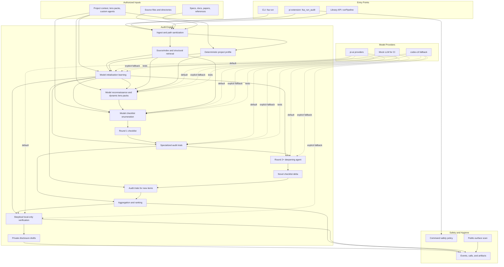

# Architecture

## Boundary

`full-stack-auditor` has two layers:

- Audit engine: deterministic TypeScript modules under `src/ingest`, `src/index`, `src/profile`, `src/learn`, `src/lens`, `src/seeders`, `src/audit`, `src/verify`, and `src/reports`.
- Pi integration: thin adapters under `src/llm/pi-ai.ts` and `src/pi/extension.ts`.
- Optional local fallback: `src/llm/codex-cli.ts` for authenticated Codex CLI environments when pi provider credentials are unavailable.

The audit engine should not depend on pi-coding-agent. This keeps batch runs, CI, web UI, RPC mode, and future coding-agent flows on the same underlying artifacts.

## Pipeline



```text
source + corpus
  -> ingest
  -> source index / retrieval
  -> deterministic project profile
  -> model initialization learning notes
  -> model project reconnaissance / dynamic lens packs
  -> optional local checklist seeders
  -> LLM enumeration
  -> round 1 checklist
  -> specialized audit trials
  -> round 2+ model deepening / novel checklist delta
  -> specialized audit trials for new items
  -> aggregation
  -> independent verification plan
  -> disclosure draft
```

Project profile, source index, initialization learning notes, dynamic lens packs, and optional local checklist seeders are planning and context mechanisms. They may propose audit questions and routing guidance, but they must not produce bug findings. Findings come only from model-backed audit trials.

`AuditorConfig.projectLearning` controls the model initialization stage. It is enabled by default for live runs and writes `project_learning.json`, a reviewable record of what the model learned from the loaded source, corpus, deterministic profile, and configured high-level scope before it proposes lenses or checklist items.

`AuditorConfig.localChecklistSeeders` controls whether deterministic seeders contribute checklist items. They are disabled by default and should be enabled only for dry-run coverage inspection or local regression tests. Source-discovery proof runs should leave them disabled so both checklist enumeration and audit findings come from model calls.

## Rounds vs Trials

The framework has two different repetition mechanisms:

- `rounds`: project exploration depth. Round 1 creates the initial checklist. Round 2 and later call a deepening agent that reads prior checklist coverage, audit observations, and ranked findings, then proposes only novel follow-up items.
- `trials`: per-item stochastic coverage. Each trial audits the same item independently so aggregation can use hit rate and confidence instead of trusting one sample.

This distinction is important. A stronger run should not merely repeat the same checklist. Later rounds must add new `(location, security property, failure mode)` coverage, and the pipeline rejects duplicates using the same normalized item key for all rounds. If a deepening round produces no new items, the run records the no-op and stops instead of replaying prior items.

The deepening stage is still a planning stage. It does not produce findings. It only expands the checklist with source-grounded questions for later audit agents.

## Agent Roles

- ProjectLearningAgent: reads loaded source and reference material, then writes source-backed planning notes without claiming vulnerabilities.
- LensDiscoveryAgent: reads the loaded project context and proposes dynamic lens packs for the target's assets, trust boundaries, invariants, attacker capabilities, and domain-specific failure modes.
- Enumerator: maps code locations, spec statements, security properties, and failure modes.
- DeepeningAgent: reads prior coverage and audit observations, then proposes novel follow-up checklist items for later rounds.
- MissingConstraintAuditor: checks whether a relied-on security property has a visible enforcement edge.
- BalanceIntegrityAuditor: checks conservation and turnstile boundaries.
- NullifierAuditor: checks uniqueness of spend markers and replay resistance.
- SpecMismatchAuditor: compares implementation and written spec line by line.
- ConsensusAuditor: checks ambiguity that could split implementations.
- VerificationAgent: refutes or confirms findings and writes local-only test scaffolds.

Audit roles are declared in `src/agents/registry.ts`. Adding a new role should be a registry change plus tests and, when useful, a local checklist seeder.

The registry is extensible at runtime. `AuditorConfig.auditorAgents` accepts additional agent definitions, and their failure modes are merged into the enumeration prompt through `effectiveFailureModes`. The audit runner builds an agent registry for each run, so custom checklist items can route to custom guidance without changing built-in agents.

Project-specific customization has two layers:

- `projectContext`: human- or config-provided assets, attacker capabilities, trust boundaries, invariants, focus areas, and out-of-scope notes.
- `lensPacks`: scenario-specific failure modes, enumeration guidance, audit guidance, and optional auditor agents.

Live runs enable `projectLearning` and `dynamicLensDiscovery` by default. Project learning writes `project_learning.json`; lens discovery writes `lens_packs.json`. Both are normalized, bounded, reviewable planning artifacts, not findings.

## Local Seeder Regression Gate

`npm run check:blind-discovery` runs the framework against a neutral fixture. The fixture does not name a target protocol, impact, or expected bug. The gate passes only if local checklist generation produces a generic missing-constraint audit item from source structure alone.

This legacy-named command is not a substitute for model discovery. Local checklist seeders prepare optional coverage; only model-backed learning, enumeration, and audit trials count as autonomous bug-discovery evidence.

## Pi Integration

The project is a pi package. `package.json` exposes:

- `src/pi/extension.ts` as an extension with audit tools.
- `skills/whitehat-auditor/SKILL.md` as operating instructions.
- `prompts/audit-target.md` as a reusable prompt template.

The extension registers read-only audit tools first. Tools that write tests or run commands should stay behind explicit user confirmation and sandbox guards.

`fsa_run_audit` defaults to dry-run so package users can inspect checklist generation before spending model calls. The extension also installs a guardrail on bash tool calls and direct user bash commands that combine public live networks with exploit/broadcast wording.

The command guardrail lives in `src/security/policy.ts` so non-pi integrations can reuse and test the same policy.

Model calls should use pi-ai providers by default. `provider=codex-cli` is an explicit local fallback for validation runs and should not replace pi package integration.

## Runnable Gates

- `npm run check`: strict TypeScript compile.
- `npm test`: build plus Node tests for JSON parsing, seeders, dry-run pipeline, mock end-to-end pipeline, and pi extension registration.
- `npm run dry-run`: local checklist seeder run against fixtures. It must produce zero findings.
- `npm run mock-run`: full model-shaped pipeline using deterministic mock LLM.
- `npm run check:blind-discovery`: local seeder regression for checklist enumeration.
- `npm run check:source-discovery -- --source <path>`: opt-in live model assertion that disables local checklist seeders by default, requires initialization learning, enumeration, and audit model calls, and requires a model-produced finding without committing that source.

Use `--rounds <n>` with the source-discovery gate when evaluating iterative deepening. Round artifacts must show that later coverage came from `deepen_round_<n>` model calls and survived duplicate filtering.

Use `--expect-location-line <n>` with `--expect-location-file-regex <regex>` when the oracle should accept a broader model-produced source range that contains the target line. Use `--run-dir <path>` to re-check an existing live run artifact without making new model calls.

## Local-Only Verification

Verification code must default to a local-only ladder:

1. Unit test against the isolated gadget/function.
2. Component test against the local protocol implementation.
3. End-to-end local regtest/devnet/forked-node test.

It must not generate or run live-network exploitation flows.
